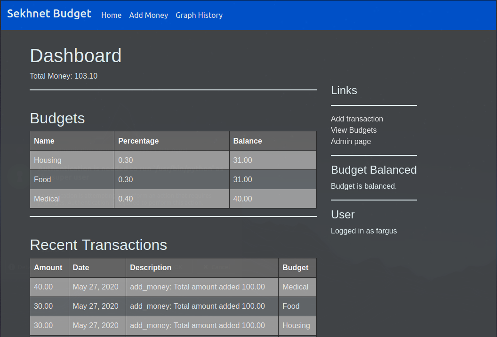
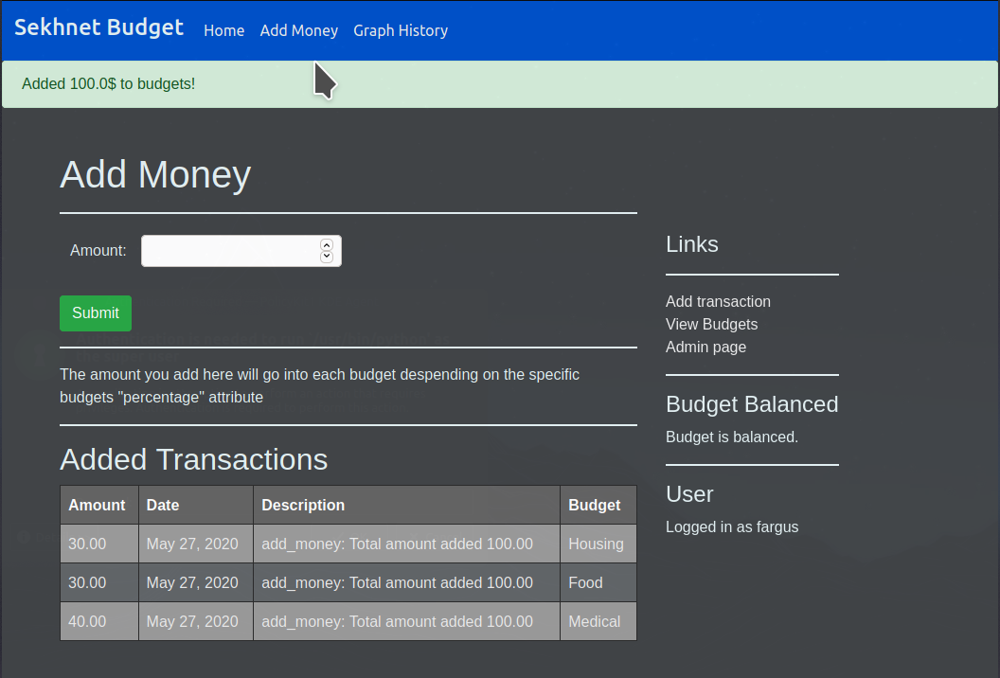
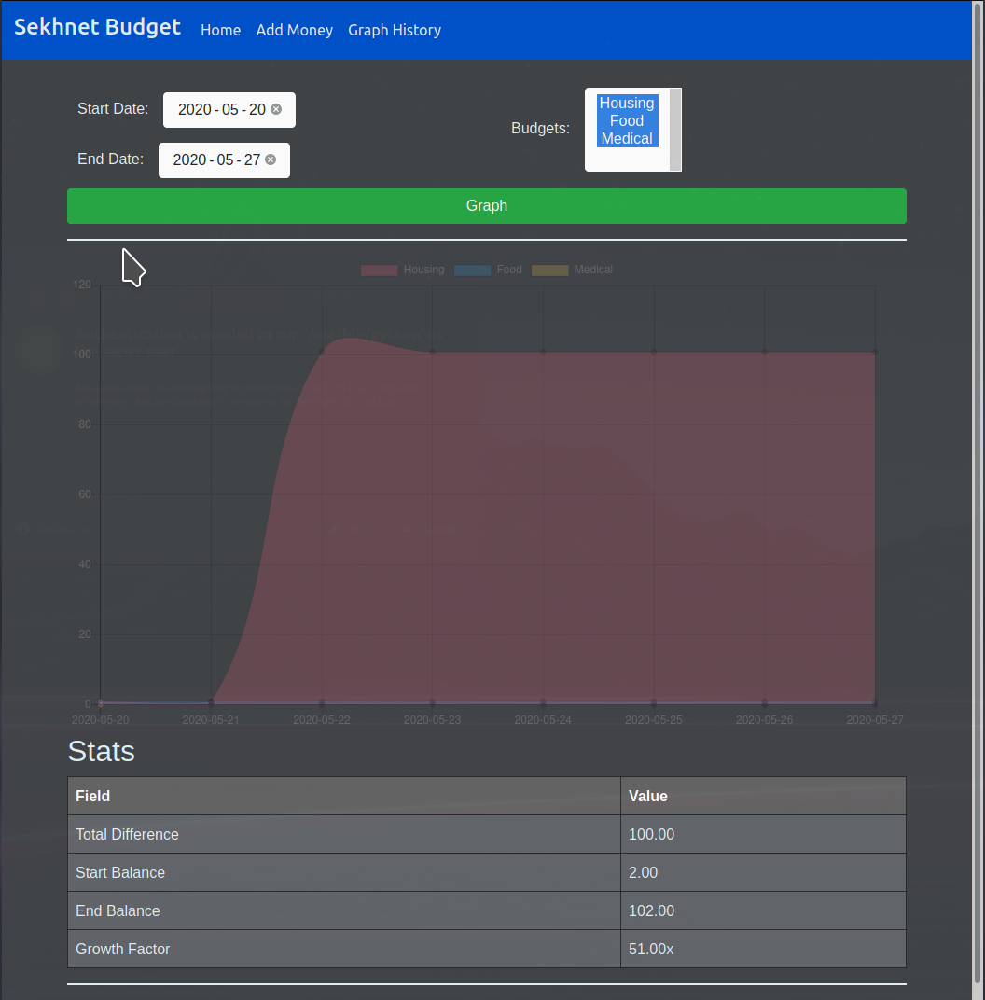

# Sekhnet Budget
_v1.0_

Very simple budgeting software I wrote
to keep track of my budgets

Sekhnet Budget is a Django based webapp that I deploy
on my local network at home using Kubernetes.

### How it works
Each budget is issued a percentage that represents
what portion of income should go to it. for example,
if housing is 30% and you add 1000$ of income, 300$ will
got to housing and the 700$ will be divided among the other 
budgets

### Stability
I have been using this for the last 6 months (as of this commit), running 
it on my local kubernetes cluster. It has been working great for me.

I intend on using and updating this for the rest of my life
But note I will likely go significant periods of time without
updating it.

### Running locally

Setup environment with your database settings
```
# copy over example environment config
cp ./docs/environment_example.py ./budget/environment.py

# edit to use your own values
vi ./budget/environment.py
```

Optionally run the dev postgres database
```
./scripts/local_db.sh
```

Then, like any Django project
```
pip3 install -r requirements.txt
python3 manage.py makemigrations
python3 manage.py migrate
python3 manage.py runserver
```

Note sometimes the api models are not migrated, this 
can be solved with:
```
python3 manage.py makemigrations api
python3 manage.py migrate
```

## UI Screenshots

**Home Page:**


**Adding income:**


**Graph history page:**

